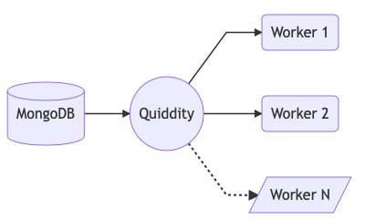

<div align="center">
  <br/>
  
  <br/>
  <br/>
  <p>
    Simple queue server that uses MongoDB to store messages
  </p>
  <br/>
</div>

---
### How it works

<div align="left">
  
</div>

- **Quiddity** is a simple server that connects to MongoDB and exposes few APIs like __*push*__, __*fetch*__ & __*delete*__.
- A seperate light-weight agent consumes these APIs and allows the user to push/pull messages from the queue.
- The user can also have multiple agents working on the queue.

---
### How to setup the agent/worker client
Install from NPM
```
npm install quiddity-agent
```

---
#### Usage

Intitalise the agent simply by creating a new instance -
```
const Queue = require('quiddity-agent')

const queue = new Queue("testQueue")
```

Push new messages into queue -
```
queue.push({ foo: "bar", ...})
// Above returns a promise
```

Pull new messages from queue -
```
queue.pull((message, done) => {
    // Do heavy work with "message"
    // Call done() to acknowledge job completion
    done()
})
```

---
#### Note -
You can also pass the following enviornment variables to configure the agent.
| Enviornment Name |        Default Value        |      Datatype      |
|:----------------:|:---------------------------:|:------------------:|
|   QUIDDITY_URL   |   "http://localhost:3000"   |       String       |
| POLLING_INTERVAL |       120000 (2 mins)       | Number (in millis) |

- `QUIDDITY_URL`
	- This is the base url of the quiddity server.
  - To check out how to setup the server, to go this link [GitHub](https://github.com/thatsKevinJain/quiddity)

- `POLLING_INTERVAL`
	- If the queue is empty and there are no messages left, the agent will poll for new messages at a set interval. 
	- Developers can modify this __*polling time*__ to suit their requirements.

---
#### Collaborators
* **Kevin Jain** - [GitHub](https://github.com/thatsKevinJain)
* **Moksh Jain** - [GitHub](https://github.com/mokshhh22)